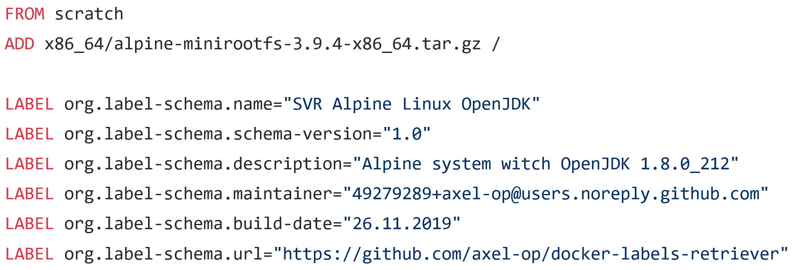

# Docker labels retriever

This action retrieves the values of [labels from the metadata of an image](https://docs.docker.com/config/labels-custom-metadata/) on Docker Hub or GitHub Packages by calling the Docker API. The image isn't actually pulled so it's very fast.

## Usage

For each label of the image, this action sets an output whose name is the name of the label **in lower case**. You have to set an id for the step of this action, so you can use the outputs in the next steps of your workflow with `${{ steps.the_id.outputs.name_of_label }}`.

Here's an example of a workflow where the values of two labels, `version` and `maintainer`, set when the image has been previously built, are retrieved:

```yml
    name: Example workflow
    on: push

    jobs:
      build:
        runs-on: ubuntu-latest
        steps:

          - name: Check labels
            id: labels # this id will be reused below
            uses: axel-op/docker-labels-retriever@master
            with:
              image: owner/repo/image:stable
              registry: github-packages
              githubToken: ${{ secrets.GITHUB_TOKEN }}

          # You can then get the values
          - name: Another step
            # ... in an if condition:
            if: steps.labels.outputs.version == '...'
            # ... in an environment variable:
            env:
              VERSION: ${{ steps.labels.outputs.version }}
              MAINTAINER: ${{ steps.labels.outputs.maintainer }}
            # ... or directly in your scripts:
            run: |
              echo "${{ steps.labels.outputs.version }}"
              echo "${{ steps.labels.outputs.maintainer }}"
```

### Inputs

* `image`: **required**. With Docker Hub the format is `repo/image_name`, with GitHub Packages it's `owner/repo/image_name`. You can add a specific tag. The `latest` tag will be used by default.
* `githubToken`: **required with GitHub Packages**, even with public images. In most cases the [`GITHUB_TOKEN`](https://help.github.com/en/actions/automating-your-workflow-with-github-actions/authenticating-with-the-github_token) should be fine. Omit it with public images on Docker Hub. Private images on Docker Hub aren't supported yet.
* `registry`: accepted values are [`github-registry`, `docker-hub`]. Defaults to `docker-hub`.
